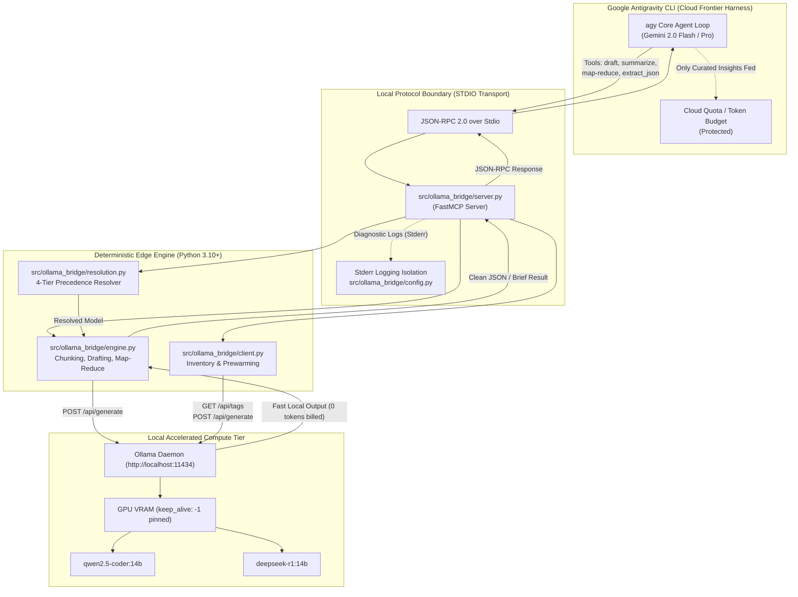

# Ollama MCP Bridge for Google Antigravity CLI (`agy`)

> **Tiered Edge-Cloud Architecture**: High-performance local inference daemon as a zero-cost semantic pre-filter, code drafter, and map-reduce compressor for [Google Antigravity CLI](file:///home/leifdavisson/.gemini/config/skills/antigravity-guide/SKILL.md).

[](https://github.com/leifdavisson/agy-ollama-mcp/actions/workflows/ci.yml)
[](file:///data/agy_ollama_mcp/LICENSE)
[](https://modelcontextprotocol.io)
[](https://ollama.com)
[](https://python.org)
[](file:///data/agy_ollama_mcp/VERIFICATION_REPORT.md)
[](file:///data/agy_ollama_mcp/VERIFICATION_REPORT.md)

---

## 1. System Context & The Token Bottleneck

[Google Antigravity CLI (`agy`)](file:///home/leifdavisson/.gemini/config/skills/antigravity-guide/SKILL.md) is a terminal-first autonomous coding agent harness designed for deep engineering workflows: repository-wide code exploration, multi-file edits, test execution, and multi-step reasoning.

Because `agy-cli` routes its primary reasoning loop through cloud-hosted frontier models (such as Gemini 2.0 Flash / Pro), feeding uncurated logs, raw data files, or entire repository ASTs rapidly inflates input/output context. This leads to quota exhaustion, throttling, and latency spikes.

```
                      [ Large Context: Dumps / Logs / Drafts ]
                                         │
                                         ▼
                              ┌──────────────────────┐
                              │   Local Pre-Filter   │  <-- Fast, Zero Token Cost (Ollama)
                              │  (Ollama / C++ Eng)  │      Summarization, Extraction, AST Pruning
                              └──────────┬───────────┘
                                         │  (Only high-density signal forwarded)
                                         ▼
                              ┌──────────────────────┐
                              │     agy-cli Core     │  <-- Protected Quota, High-Speed Reasoning
                              │ (Gemini 2.0 / Cloud) │      Strategic Decisions, Code Synthesis
                              └──────────────────────┘
```

By placing [Ollama](https://ollama.com) as a local semantic pre-filter via the open [Model Context Protocol (MCP)](https://modelcontextprotocol.io), you offload token-heavy preliminary workloads, saving **70% to 95%** of cloud context tokens while accelerating turnaround latency.

---

## 2. Architecture & Data Flow



---

## 3. Registered MCP Tools

The bridge daemon registers 7 specialized Model Context Protocol tools:

| Tool Name | Parameters | Purpose & Rationale |
| :--- | :--- | :--- |
| [`local_draft_code`](file:///data/agy_ollama_mcp/src/ollama_bridge/engine.py#L103) | `task_description`, `context`, `language`, `model` | Drafts code implementations, boilerplate, and scaffolding locally without burning cloud tokens. |
| [`local_summarize_and_extract`](file:///data/agy_ollama_mcp/src/ollama_bridge/engine.py#L129) | `content`, `extraction_goal`, `model` | Strips noise, boilerplate, and repetitive lines from logs or text into a high-density technical summary. |
| [`local_chunked_summary`](file:///data/agy_ollama_mcp/src/ollama_bridge/engine.py#L145) | `content`, `extraction_goal`, `chunk_chars`, `model` | In-memory line-aware chunk partitioning and tree-synthesis map-reduce for texts exceeding single-pass limits. |
| [`local_map_reduce_file`](file:///data/agy_ollama_mcp/src/ollama_bridge/engine.py#L249) | `file_path`, `extraction_goal`, `chunk_size`, `overlap`, `concurrency`, `model` | **File-direct** sliding-window map-reduce. Streams multi-megabyte files directly from disk, runs concurrent worker map distillation with `NO_SIGNAL` pruning, and synthesizes an executive diagnostic brief (< 2KB) to protect STDIO and cloud context. |
| [`local_extract_json`](file:///data/agy_ollama_mcp/src/ollama_bridge/engine.py#L187) | `content`, `schema_description`, `model` | Extracts strict structured JSON conforming to a specified schema at low temperature (`0.1`). |
| [`local_list_models`](file:///data/agy_ollama_mcp/src/ollama_bridge/client.py#L129) | *(none)* | Queries `/api/tags`, calculates sizes in gigabytes, parses parameter counts and quantization, and marks active default. |
| [`local_prewarm_model`](file:///data/agy_ollama_mcp/src/ollama_bridge/client.py#L137) | `model` | Sends `keep_alive: -1` to `/api/generate` to pin model weights into GPU VRAM and eliminate cold-start latency. |

---

## 4. Antigravity CLI Integration & Slash Commands

### 4.1. FastMCP Daemon Registration
Add the bridge to your Antigravity configuration at [`~/.gemini/config/mcp_config.json`](file:///home/leifdavisson/.gemini/config/mcp_config.json):

```json
{
  "mcpServers": {
    "local-ollama": {
      "command": "python3",
      "args": [
        "/home/leifdavisson/.local/bin/ollama_mcp_bridge.py"
      ],
      "env": {
        "LOCAL_LLM_MODEL": "qwen2.5-coder:14b",
        "OLLAMA_HOST": "http://localhost:11434"
      }
    }
  }
}
```

### 4.2. Installed Antigravity Skills

The project installs two complementary slash commands for `agy-cli`:

1. **`/local-draft`** ([Open SKILL.md](file:///home/leifdavisson/.gemini/config/skills/local-draft/SKILL.md) (file:///home/leifdavisson/.gemini/config/skills/local-draft/SKILL.md)):
   Forces AST parsing, code scaffolding, or boilerplate generation onto local Ollama models.
   ```bash
   /local-draft Create a Pydantic V2 schema for our customer ingestion webhook
   ```

2. **`/reduce`** ([Open SKILL.md](file:///home/leifdavisson/.gemini/config/skills/reduce/SKILL.md) (file:///home/leifdavisson/.gemini/config/skills/reduce/SKILL.md)):
   Performs file-direct chunked map-reduce on massive files (>300 lines) before ingesting into context.
   ```bash
   /reduce /var/log/syslog.log "Identify database connection timeouts and trace IDs"
   ```

### 4.3. Standalone CLI Utility (`chunk_reduce.py`)

Run the map-reduce pipeline directly from your shell or pipe from stdin:

```bash
# File direct execution:
chunk_reduce.py -f /var/log/syslog.log -g "Find failed SSH logins" -j 4

# Piped execution:
cat massive_output.txt | chunk_reduce.py -g "Extract unhandled exceptions"
```

---

## 5. Automated Verification & Validation (DO-178C Level A)

The codebase is governed by formal INCOSE requirements and verified according to **DO-178C Level A High-Assurance** verification criteria:

| Metric | Required Standard | Achieved Result |
| :--- | :---: | :---: |
| **Requirements Verified** | 100% (9 / 9) | **100% (9 / 9)** |
| **Uncovered Requirements** | 0 | **0** |
| **Orphaned Tests** | 0 | **0** |
| **Total Test Suite** | >= 80 | **139 Passed (135 AST Mapped)** |
| **Statement Coverage** | 100.0% | **100.0% (366 / 366 statements)** |
| **Branch Coverage** | 100.0% | **100.0% (92 / 92 branches)** |
| **DO-178C Level A MC/DC** | 100.0% | **100.0% Verified Pairs** |
| **Mutation Kill Score** | >= 90.0% | **91.0% (mutmut)** |
| **Strict Static Typing** | 0 errors | **0 errors (`mypy --strict src/`)** |
| **Protocol Isolation** | Pure JSON-RPC | **Zero stdout pollution (stderr isolated)** |

Detailed audit documentation and artifacts:
- [Open VERIFICATION_REPORT.md](file:///data/agy_ollama_mcp/VERIFICATION_REPORT.md) (file:///data/agy_ollama_mcp/VERIFICATION_REPORT.md)
- [Open RTM_MATRIX.json](file:///data/agy_ollama_mcp/RTM_MATRIX.json) (file:///data/agy_ollama_mcp/RTM_MATRIX.json)
- [Open requirements.json](file:///data/agy_ollama_mcp/requirements.json) (file:///data/agy_ollama_mcp/requirements.json)
- [Open features/](file:///data/agy_ollama_mcp/features/) (file:///data/agy_ollama_mcp/features/)

---

## 6. Quick Start & Installation

### Requirements
- Python 3.10+
- [Ollama](https://ollama.com) running locally (`http://localhost:11434`)
- Recommended local models: `qwen2.5-coder:14b` or `deepseek-r1:14b`

### Installation

```bash
# 1. Clone repository
git clone https://github.com/leifdavisson/agy-ollama-mcp.git
cd agy-ollama-mcp

# 2. Install package in editable mode
pip install -e .
pip install -r requirements-dev.txt

# 3. Pull recommended local models in Ollama
ollama pull qwen2.5-coder:14b
ollama pull deepseek-r1:14b

# 4. Verify local installation
pytest --cov=src --cov-branch --cov-fail-under=100 tests/
python3 scripts/verify_mcdc.py
python3 scripts/generate_rtm.py
```

---

## 7. Configuration Environment Variables

| Variable | Default | Description |
| :--- | :--- | :--- |
| `OLLAMA_HOST` | `http://localhost:11434` | Endpoint of the local [Ollama](https://ollama.com) daemon. |
| `LOCAL_LLM_MODEL` | Auto-detected | Preferred model override (e.g. `qwen2.5-coder:14b`, `deepseek-r1:14b`). |
| `OLLAMA_TIMEOUT` | `180` | Request timeout in seconds for generation tasks. |
| `OLLAMA_NUM_CTX` | `16384` | Context window size allocated in local model memory. |
| `OLLAMA_TEMPERATURE` | `0.2` | Sampling temperature for code generation. |
| `OLLAMA_MCP_DEBUG` | `0` | Set to `1` to enable verbose diagnostic output to `stderr`. |

---

## 8. Companion Ecosystem & Project Attribution

This project is built atop the open-source AI and developer tooling ecosystem. Direct backlinks to official project documentation, homepages, and repositories:

- **[Ollama](https://ollama.com)**: Official Runtime Daemon ([GitHub Repository](https://github.com/ollama/ollama))
- **[Model Context Protocol (MCP)](https://modelcontextprotocol.io)**: Standard Specification ([GitHub Organization](https://github.com/modelcontextprotocol))
- **[FastMCP](https://github.com/jlowin/fastmcp)**: Pythonic Model Context Protocol Framework ([PyPI](https://pypi.org/project/mcp/))
- **[Qwen2.5-Coder](https://github.com/QwenLM/Qwen2.5-Coder)**: Specialized Code Intelligence Model ([Ollama Card](https://ollama.com/library/qwen2.5-coder))
- **[DeepSeek-R1](https://github.com/deepseek-ai/DeepSeek-R1)**: Reasoning and Verification Model ([Ollama Card](https://ollama.com/library/deepseek-r1))
- **[llama.cpp](https://github.com/ggerganov/llama.cpp)**: Pure C/C++ Inference Engine
- **[Google Antigravity CLI (`agy`)](file:///home/leifdavisson/.gemini/config/skills/antigravity-guide/SKILL.md)**: Autonomous Terminal Coding Harness ([Open antigravity-guide](file:///home/leifdavisson/.gemini/config/skills/antigravity-guide/SKILL.md) (file:///home/leifdavisson/.gemini/config/skills/antigravity-guide/SKILL.md))

---

## 9. License

This project is licensed under the **GNU Affero General Public License v3.0 (GNU AGPLv3)**. See [LICENSE](file:///data/agy_ollama_mcp/LICENSE) ([Open LICENSE](file:///data/agy_ollama_mcp/LICENSE) (file:///data/agy_ollama_mcp/LICENSE)) for full legal terms.
