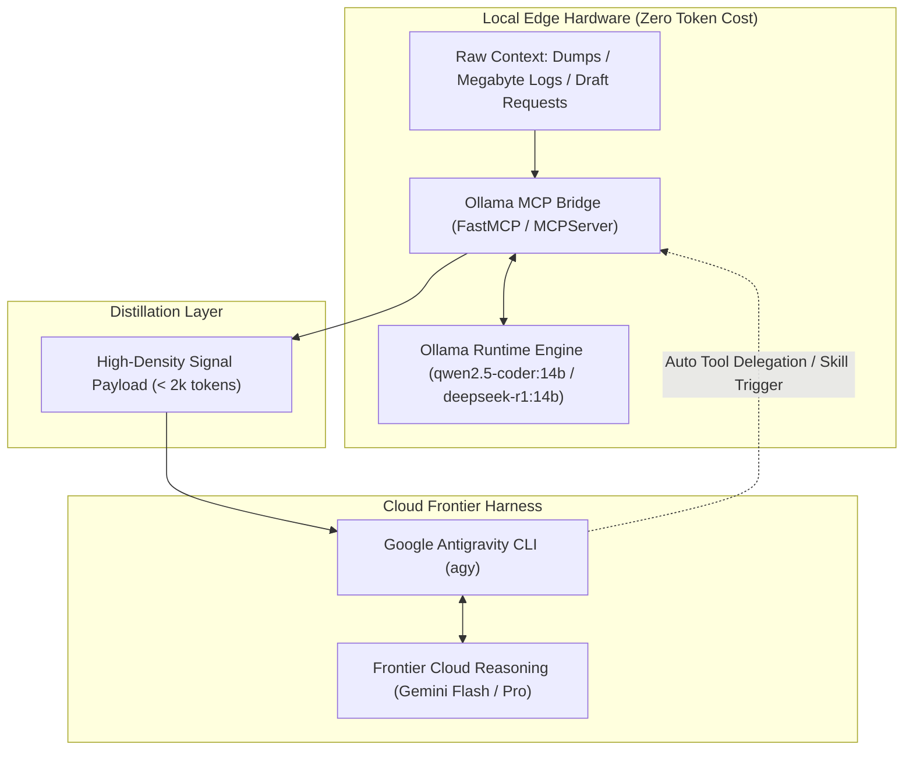

# Ollama MCP Bridge for Google Antigravity CLI (`agy`)

> **Tiered Edge-Cloud Architecture**: Local models as zero-cost semantic pre-filters, log extractors, and speculative drafters for [Google Antigravity CLI](https://antigravity.google).

[](file:///data/agy_ollama_mcp/LICENSE)
[](https://modelcontextprotocol.io)
[](https://ollama.com)

---

## 1. System Context & The Token Bottleneck

[Google Antigravity CLI (`agy`)](https://antigravity.google) is an agentic coding harness designed for deep engineering workflows: repository exploration, multi-file edits, test execution, and multi-step reasoning.

Because `agy-cli` routes its primary reasoning loop through cloud-hosted frontier models (such as Gemini 2.0 / Flash / Pro), feeding raw logs, terminal dumps, or large codebases rapidly exhausts quota and drives up latency.

### Tiered Architecture Diagram



By placing [Ollama](https://ollama.com) as a local semantic filter via the [Model Context Protocol (MCP)](https://modelcontextprotocol.io), you offload token-heavy preliminary workloads, saving **70% to 95%** of cloud context tokens.

---

## 2. Multi-Model Orchestration Patterns

| Pattern | How It Works | Best Used For | Token Savings |
| :--- | :--- | :--- | :--- |
| **Tool-Augmented Offloading (MCP)** | `agy-cli` delegates specific subtasks to a local model via Model Context Protocol tools. | Summarizing large files, log parsing, extracting JSON schemas. | **70% – 90%** |
| **Hierarchical Speculative Drafting** | Local models generate rough code/documentation drafts; `agy-cli` reviews, refines, and merges. | Boilerplate generation, test scaffolding, docstrings. | **50% – 70%** |
| **Map-Reduce / Chunked Compression** | Local engine chunks multi-megabyte payloads, summarizes each chunk locally, and passes unified brief. | Full-repo audits, massive stack traces, documentation ingestion. | **85% – 95%** |

---

## 3. Registered MCP Tools

The bridge exposes 6 specialized tools:

1. [`local_draft_code`](file:///data/agy_ollama_mcp/ollama_mcp_bridge.py#L110-L132)  
   Generates initial code drafts, boilerplate, unit tests, or scaffolding locally via Ollama without consuming cloud tokens.
2. [`local_summarize_and_extract`](file:///data/agy_ollama_mcp/ollama_mcp_bridge.py#L135-L151)  
   Compresses massive files, logs, terminal traces, or documentation into high-density summaries before cloud reasoning.
3. [`local_chunked_summary`](file:///data/agy_ollama_mcp/ollama_mcp_bridge.py#L154-L198)  
   Map-reduce chunked summarization for massive files that exceed single context limits.
4. [`local_extract_json`](file:///data/agy_ollama_mcp/ollama_mcp_bridge.py#L201-L215)  
   Extracts strict structured JSON schemas from unstructured text or logs.
5. [`local_list_models`](file:///data/agy_ollama_mcp/ollama_mcp_bridge.py#L218-L232)  
   Enumerates installed local models, parameter sizes, quantization levels, and the active default.
6. [`local_prewarm_model`](file:///data/agy_ollama_mcp/ollama_mcp_bridge.py#L235-L250)  
   Pins a local model in memory/VRAM (`keep_alive: -1`) to eliminate cold-start latency.

---

## 4. Configuration & Installation

### Quick Start

1. **Install dependencies:**
   ```bash
   pip install --user mcp requests pytest
   ```

2. **Deploy the script to `~/.local/bin`:**
   ```bash
   cp /data/agy_ollama_mcp/ollama_mcp_bridge.py ~/.local/bin/ollama_mcp_bridge.py
   chmod +x ~/.local/bin/ollama_mcp_bridge.py
   ```

3. **Register in Antigravity MCP Configuration:**
   Add to [`~/.gemini/config/mcp_config.json`](file:///home/leifdavisson/.gemini/config/mcp_config.json):
   ```json
   {
     "mcpServers": {
       "local-ollama": {
         "command": "python3",
         "args": [
           "/home/leifdavisson/.local/bin/ollama_mcp_bridge.py"
         ],
         "env": {
           "LOCAL_LLM_MODEL": "qwen2.5-coder:14b",
           "OLLAMA_HOST": "http://localhost:11434"
         }
       }
     }
   }
   ```

4. **Install the Antigravity Skill:**
   Deploy [`skills/local-draft/SKILL.md`](file:///data/agy_ollama_mcp/skills/local-draft/SKILL.md) to `~/.agents/skills/local-draft/SKILL.md`.

---

## 5. Environment Variables

| Variable | Default | Description |
| :--- | :--- | :--- |
| `OLLAMA_HOST` | `http://localhost:11434` | Endpoint of the local [Ollama](https://ollama.com) daemon. |
| `LOCAL_LLM_MODEL` | Auto-detected | Preferred model (e.g. `qwen2.5-coder:14b`, `deepseek-r1:14b`, `llama3.2:latest`). |
| `OLLAMA_TIMEOUT` | `180` | Timeout in seconds for generation requests. |
| `OLLAMA_NUM_CTX` | `16384` | Context window size allocated in Ollama. |
| `OLLAMA_TEMPERATURE` | `0.2` | Sampling temperature for code generation. |
| `OLLAMA_MCP_DEBUG` | `0` | Set to `1` to enable verbose logging to `stderr`. |

---

## 6. Operational Workflows in `agy-cli`

### Mode A: Automatic Delegation
Ask `agy` to inspect a large log or file:
> *"Analyze server.log and find all database connection timeout stack traces."*

`agy` automatically invokes `local-ollama`'s `local_summarize_and_extract`, compressing 10,000 lines into a ~150-token distilled summary before feeding it to cloud reasoning.

### Mode B: Manual Skill Trigger (`/local-draft`)
Trigger the local stack explicitly from the `agy` prompt box:
> `/local-draft Create a Pydantic V2 schema for our customer ingestion webhook`

The agent delegates the code scaffolding to local Ollama hardware, reviews the draft, and presents the final verified code.

---

## 7. Project Attribution & Backlinks

- [Ollama Official Website](https://ollama.com) & [Ollama GitHub Repository](https://github.com/ollama/ollama)
- [Model Context Protocol (MCP) Official Documentation](https://modelcontextprotocol.io) & [MCP GitHub Organization](https://github.com/modelcontextprotocol)
- [MCP Python SDK](https://github.com/modelcontextprotocol/python-sdk) & [FastMCP](https://github.com/jlowin/fastmcp)
- [Qwen2.5-Coder Official Repository](https://github.com/QwenLM/Qwen2.5-Coder)
- [DeepSeek-R1 Official Repository](https://github.com/deepseek-ai/DeepSeek-R1)
- [rawveg/ollama-mcp Companion Server](https://github.com/rawveg/ollama-mcp)
- [llama.cpp](https://github.com/ggerganov/llama.cpp) & [llama-cpp-python](https://github.com/abetlen/llama-cpp-python)
- [Google Antigravity CLI Harness](https://antigravity.google)

---

## 8. File References

- [Open README.md](file:///data/agy_ollama_mcp/README.md) (file:///data/agy_ollama_mcp/README.md)
- [Open ollama_mcp_bridge.py](file:///data/agy_ollama_mcp/ollama_mcp_bridge.py) (file:///data/agy_ollama_mcp/ollama_mcp_bridge.py)
- [Open SKILL.md](file:///data/agy_ollama_mcp/skills/local-draft/SKILL.md) (file:///data/agy_ollama_mcp/skills/local-draft/SKILL.md)
- [Open mcp_config.json](file:///home/leifdavisson/.gemini/config/mcp_config.json) (file:///home/leifdavisson/.gemini/config/mcp_config.json)
- [Open LICENSE](file:///data/agy_ollama_mcp/LICENSE) (file:///data/agy_ollama_mcp/LICENSE)

---

## 9. License

This project is licensed under the **GNU Affero General Public License v3.0 (GNU AGPLv3)**. See [LICENSE](file:///data/agy_ollama_mcp/LICENSE) (file:///data/agy_ollama_mcp/LICENSE) for details.
